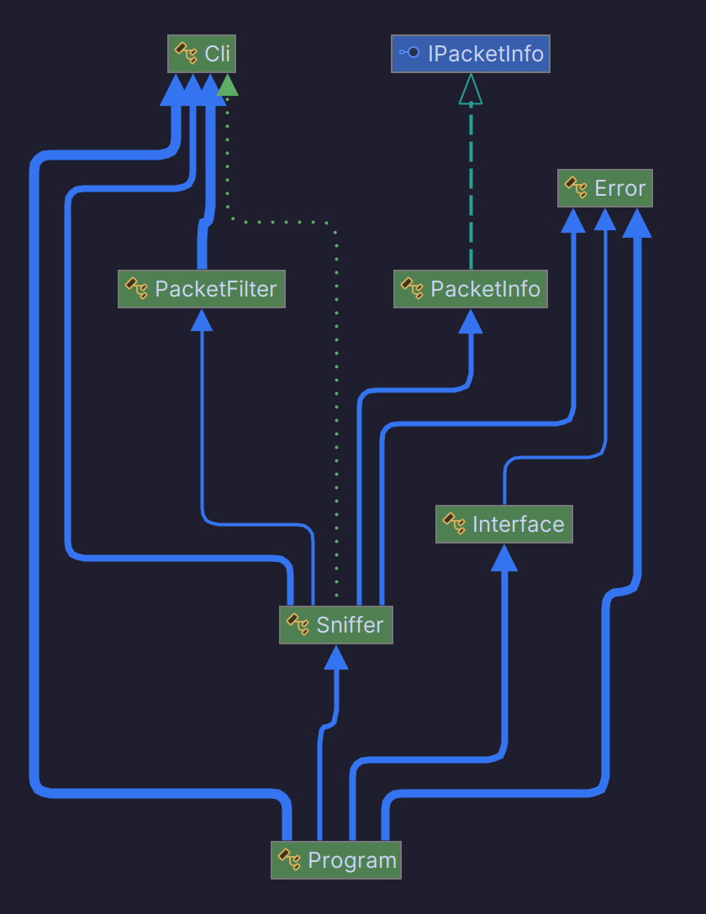

<div align="center">

[]()

# IPK Packet Sniffer

</div>

## Table of contents

- [Executive Summary](#summary)
- [Implementation](#implementation)
  - [Capturing Packets](#capturing-packets)
  - [Filtering](#filtering)
  - [Output](#output)
- [Building the Project](#building-the-project)
- [Usage](#usage)
- [Testing](#testing)
- [Bibliography](#bibliography)

## Summary

The ipk-sniffer is a simple packet sniffer that allows you to monitor 
network traffic. This packet sniffer can be used for network 
troubleshooting and security analysis.[1]

The ipk-sniffer not only captures packets, but also provides usefully set
of filters that enable you to select which packets to capture and display.
The user can choose how many packets to capture. After capturing a packet 
important information about the packet as well as hex dump is shown.

## Implementation



The program begins by argument parsing and validation. The entered interface
is then checked, if no interface was entered or the interface provided does
not exist, the program provides the user with available interfaces. If all
above-mentioned checks were successful the program begins sniffing.

### Capturing Packets

The sniffing begins with opening the capturing device and registering a method
for handling captured packets. The method in question can be seen bellow.
```csharp
public static void Sniff(Cli args) {
    _args = args;

    // Get capturing device
    _dev = CaptureDeviceList.Instance.FirstOrDefault(device => device.Name == args.Interface);

    if (_dev == null) {
        throw new Exception($"Device {args.Interface} not found");
    }

    // Register packet handler
    _dev.OnPacketArrival += new PacketArrivalEventHandler(OnPacket);
    _dev.Open(DeviceModes.Promiscuous);
    _dev.StartCapture();

    // Wait while capturing packets
    while (true) { }
}
```

The capturing interface is closed after all packets have been captured.

### Filtering

Before packets are printed they go through a filter first. The filter starts by 
checking if any filtering arguments were provided and decide if any filtering is
needed. The filter first extracts the Ethernet Type of packet. If the packets 
Ethernet Type is IP, the packet is subjected to further filtering. This includes
filtering based on protocol, source and destination ports.

Most of the filtering by protocol is done by simply checking the `ProtocolType` of 
the packet, this does not apply for MLD and NDP packets as they are subset of
ICMPv6 protocol. These packets are filtered based on the `IcmpV6Type`. The 
desired `IcmpV6Type` for MLD and NDP are listed bellow.

#### NDP

- `IcmpV6Type.RouterSolicitation`
- `IcmpV6Type.RouterAdvertisement`
- `IcmpV6Type.NeighborSolicitation`
- `IcmpV6Type.NeighborAdvertisement`
- `IcmpV6Type.RedirectMessage`

#### MLD

- `IcmpV6Type.MulticastListenerQuery`
- `IcmpV6Type.MulticastListenerReport`
- `IcmpV6Type.MulticastListenerDone`

### Output

After passing all the filtering stages, the packet is the formated and outputted
to the console. An example of hwo the output looks like can be seen bellow.

```
Packet 1/1
timestamp: 2024-04-22T05:57:26
src MAC: 8a:b8:fa:26:bb:a1
dst MAC: 16:95:68:32:74:68
frame length: 66 bytes
src IP: 199.232.17.91
dst IP: 192.168.109.33
src port: 443
dst port: 40414
protocol: Tcp
ethernet type: IPv4

0x0000: 16 95 68 32 74 68 8a b8  fa 26 bb a1 08 00 45 00  ..h2th.¸ú&»¡..E.
0x0010: 00 34 1a 85 40 00 36 06  23 32 c7 e8 11 5b c0 a8  .4..@.6.#2Çè.[À¨
0x0020: 6d 21 01 bb 9d de f5 04  e0 d7 09 8a 20 d1 80 10  m!.».Þõ.à×.. Ñ..
0x0030: 01 2d a5 9c 00 00 01 01  08 0a ed b7 30 14 4d 19  .-¥.......í·0.M.
0x0040: be 2f                                             ¾/              
```

## Building the project

To build the project, use the included makefile.<br>
Running `make` will compile the program and move the executable
to the root directory.

## Usage

```
./ipk-sniffer [-i interface | --interface interface] {-p|--port-source|--port-destination port [--tcp|-t] [--udp|-u]} [--arp] [--ndp] [--icmp4] [--icmp6] [--igmp] [--mld] {-n num}

-i, --interface       Interface to sniff
-p, --port            Filter by port number
--port-destination    Filter by destination port number
--port-source         Filter by source port number
-t, --tcp             Display only TCP packets
-u, --udp             Display only UDP packets
--icmp4               Display only ICMPv4 packets
--icmp6               Display only ICMPv6 packets
--arp                 Display only ARP packets
--ndp                 Display only NDP packets
--igmp                Display only IGMP packets
--mld                 Display only MLD packets
-n                    Number of packets to capture (Default: 1)
--help                Display this help screen.
--version             Display version information.
```

## Testing

All testing was conducted manually. All filters were tested by individually applying
them and comparing the actual output to what was expected. To verify the correctness
of the output, results were cross-referenced with results Wireshark.

Version 4.2.4 of Wireshark was used for cross-referencing output and all testing was
conducted on Arch Linux distribution and on multiple network interfaces.

## Bibliography

[1]Solarwinds, Network Packet Sniffer[online] 2024 [cit. 2024-04-01]. Available at: https://www.solarwinds.com/network-performance-monitor/use-cases/packet-sniffer
